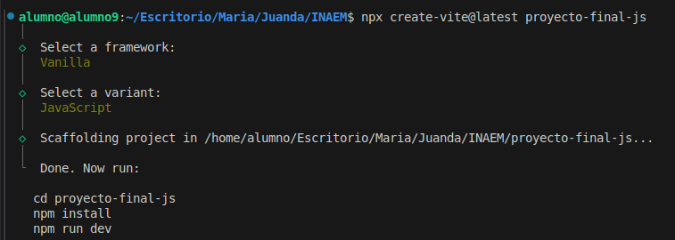
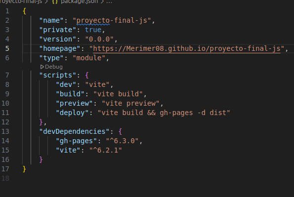

# proyecto-final-js

1.  Creamos el proyecto
 npx create-vite@latest proyecto-final-js

2. Añadimos en package.json

3. Creamos el nuevo repositorio.

# Para

- npm install
- npm install gh-pages --save-dev
- npm run deploy
- npm run build

## intalar vite
- npm install vite --save-dev

4. Index