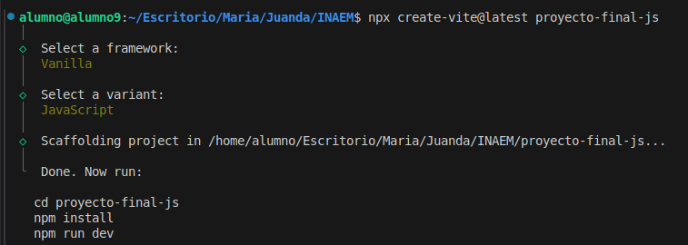
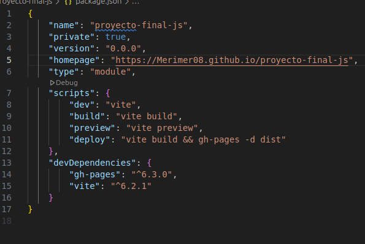
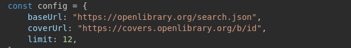
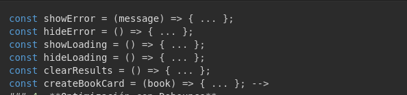
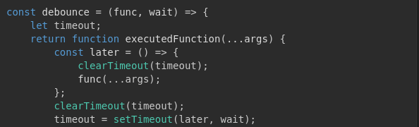
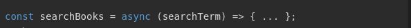
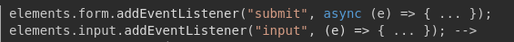
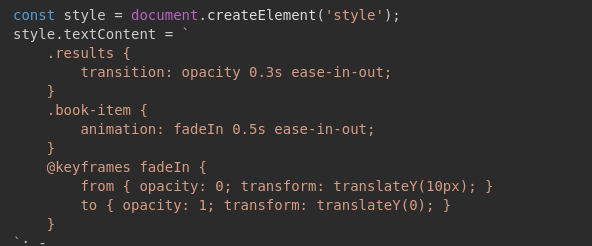

# proyecto-final-js

1.  Creamos el proyecto
 npx create-vite@latest proyecto-final-js

2. Añadimos en package.json

3. Creamos el nuevo repositorio.

# Para

- npm install
- npm install gh-pages --save-dev
- npm run deploy
- npm run build

## intalar vite
- npm install vite --save-dev

4. Index

5. Main
- Lo más relevante:
- Captura el formulario y los elementos clave del DOM.
- Configura la API de Open Library.
- Muestra/oculta errores y la carga.
- Genera tarjetas de libros con título, autor y portada.
- Maneja la búsqueda y muestra los resultados en pantalla.
# Buscador de Libros

Este proyecto es una aplicación que permite buscar libros usando la API de Open Library. Al ingresar un título de libro en el campo de búsqueda, la aplicación muestra los resultados con el título del libro, el autor, el año de publicación y la portada (si está disponible). Además, se implementa una optimización con "debounce" para mejorar la búsqueda en tiempo real.

## Estructura del Código

### 1. **Elementos del DOM**
El código empieza por definir los elementos HTML que serán manipulados. Estos son:

- **`form`**: El formulario donde el usuario ingresa el título del libro.
- **`input`**: El campo de texto donde el usuario escribe el término de búsqueda.
- **`error`**: El contenedor donde se mostrará un mensaje de error si ocurre un problema.
- **`loading`**: El mensaje que indica que la aplicación está buscando libros.
- **`results`**: El contenedor donde se mostrarán los resultados de la búsqueda.

### 2. **Configuración de la API**

En el objeto `config` se encuentran los parámetros clave que permiten realizar la búsqueda de libros en la API de Open Library:

- **`baseUrl`**: La URL base de la API de Open Library.
- **`coverUrl`**: La URL base para obtener las imágenes de portada de los libros.
- **`limit`**: El límite de resultados que la búsqueda devolverá.

### 3. **Funciones Auxiliares**

A continuación, se definen varias funciones que ayudan a gestionar la interfaz de usuario y los resultados:

- **showError(message)**: Muestra un mensaje de error en caso de que haya un problema durante la búsqueda.
- **hideError()**: Oculta el mensaje de error.
- **showLoading()**: Muestra el mensaje de carga mientras se está realizando la búsqueda.
- **hideLoading()**: Oculta el mensaje de carga después de recibir los resultados.
- **clearResults()**: Limpia los resultados anteriores antes de mostrar nuevos.
- **createBookCard(book)**: Crea el HTML para mostrar la información de un libro en la interfaz.

### 4. **Optimización con Debounce**

Se ha implementado una técnica llamada **debounce** para optimizar las búsquedas mientras el usuario escribe en el campo de búsqueda. Esto evita que se realicen múltiples peticiones a la API de manera rápida y repetitiva, mejorando el rendimiento de la aplicación.

### 5. **Función de Búsqueda**

La función **`searchBooks`** realiza la búsqueda de libros usando el término ingresado por el usuario. Realiza una solicitud a la API, procesa la respuesta y muestra los resultados. Si no se encuentran libros, muestra un mensaje informando al usuario. Además, utiliza la función `createBookCard` para crear una tarjeta por cada libro encontrado.

### 6. **Event Listeners**

Se agregan dos escuchadores de eventos para manejar las interacciones del usuario:

- **Al enviar el formulario**, se captura el término de búsqueda y se realiza la búsqueda.
- **Mientras el usuario escribe**, se activa la búsqueda con la función debounced para optimizar las peticiones a la API.

### 7. **Estilos Dinámicos**

Se agregan estilos dinámicamente para mejorar la presentación de los resultados. Por ejemplo, se crea una animación suave para los resultados de la búsqueda, haciendo que los resultados aparezcan gradualmente con una transición de opacidad.

